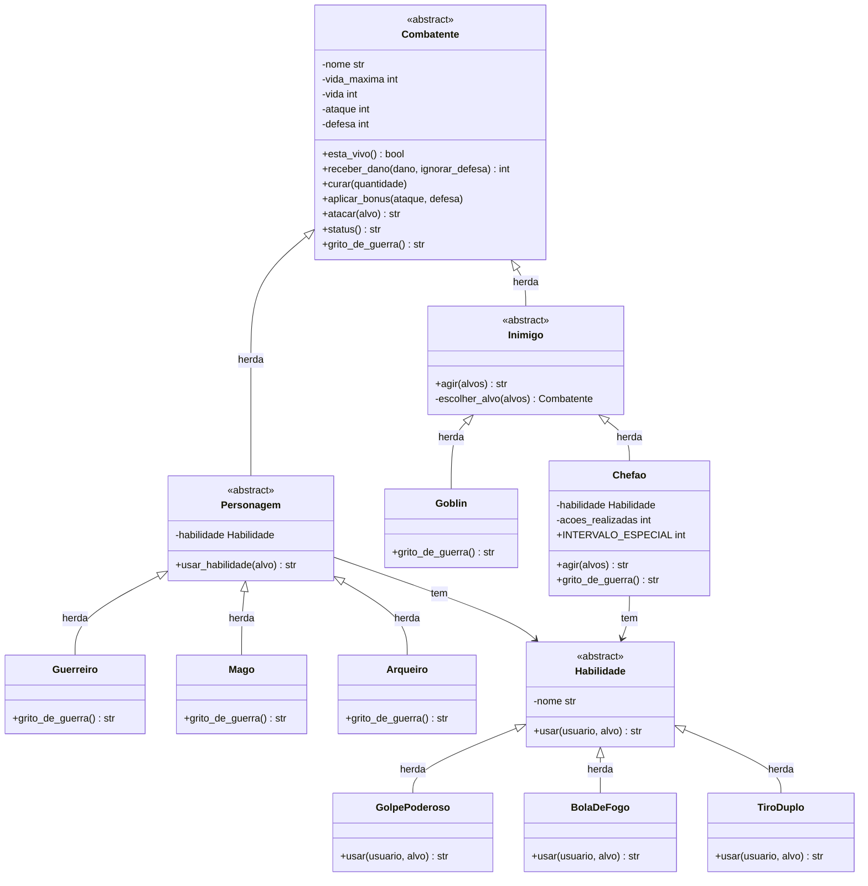
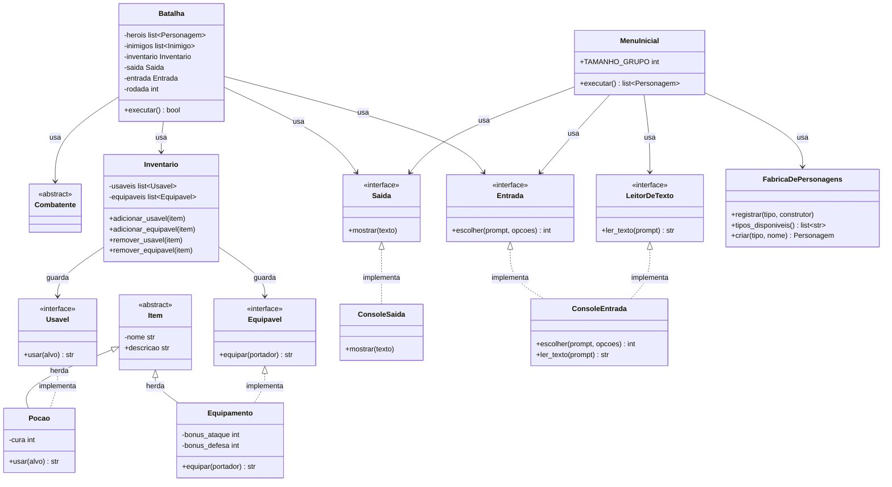

# Diagramas de classes

Diagramas em Mermaid (renderizados automaticamente pelo GitHub).

## 1. Combatentes e habilidades

```mermaid
classDiagram
    direction TB

    class Combatente {
        <<abstract>>
        -nome str
        -vida_maxima int
        -vida int
        -ataque int
        -defesa int
        +esta_vivo() bool
        +receber_dano(dano, ignorar_defesa) int
        +curar(quantidade)
        +aplicar_bonus(ataque, defesa)
        +atacar(alvo) str
        +status() str
        +grito_de_guerra() str
    }
    class Personagem {
        <<abstract>>
        -habilidade Habilidade
        +usar_habilidade(alvo) str
    }
    class Guerreiro {
        +grito_de_guerra() str
    }
    class Mago {
        +grito_de_guerra() str
    }
    class Arqueiro {
        +grito_de_guerra() str
    }
    class Inimigo {
        <<abstract>>
        +agir(alvos) str
        -escolher_alvo(alvos) Combatente
    }
    class Goblin {
        +grito_de_guerra() str
    }
    class Chefao {
        -habilidade Habilidade
        -acoes_realizadas int
        +INTERVALO_ESPECIAL int
        +agir(alvos) str
        +grito_de_guerra() str
    }
    class Habilidade {
        <<abstract>>
        -nome str
        +usar(usuario, alvo) str
    }
    class GolpePoderoso {
        +usar(usuario, alvo) str
    }
    class BolaDeFogo {
        +usar(usuario, alvo) str
    }
    class TiroDuplo {
        +usar(usuario, alvo) str
    }

    Combatente <|-- Personagem : herda
    Combatente <|-- Inimigo : herda
    Personagem <|-- Guerreiro : herda
    Personagem <|-- Mago : herda
    Personagem <|-- Arqueiro : herda
    Inimigo <|-- Goblin : herda
    Inimigo <|-- Chefao : herda
    Habilidade <|-- GolpePoderoso : herda
    Habilidade <|-- BolaDeFogo : herda
    Habilidade <|-- TiroDuplo : herda
    Personagem --> Habilidade : tem
    Chefao --> Habilidade : tem

    classDef base fill:#fdf2ff,stroke:#e879f9,color:#333
    classDef teal fill:#f0fdfa,stroke:#2dd4bf,color:#333
    classDef orange fill:#fff7ed,stroke:#fb923c,color:#333
    classDef amber fill:#fefce8,stroke:#facc15,color:#333
    classDef cyan fill:#ecfeff,stroke:#22d3ee,color:#333
    classDef red fill:#fef2f2,stroke:#f87171,color:#333
    classDef violet fill:#f5f3ff,stroke:#a78bfa,color:#333
    class Combatente:::base
    class Personagem:::base
    class Guerreiro:::teal
    class Mago:::orange
    class Arqueiro:::amber
    class Inimigo:::cyan
    class Goblin:::cyan
    class Chefao:::red
    class Habilidade:::violet
    class GolpePoderoso:::violet
    class BolaDeFogo:::violet
    class TiroDuplo:::violet
```

## 2. Batalha, itens e interface de console

```mermaid
classDiagram
    direction TB

    class Batalha {
        -herois list~Personagem~
        -inimigos list~Inimigo~
        -inventario Inventario
        -saida Saida
        -entrada Entrada
        -rodada int
        +executar() bool
    }
    class Combatente {
        <<abstract>>
    }
    class Inventario {
        -usaveis list~Usavel~
        -equipaveis list~Equipavel~
        +adicionar_usavel(item)
        +adicionar_equipavel(item)
        +remover_usavel(item)
        +remover_equipavel(item)
    }
    class Usavel {
        <<interface>>
        +usar(alvo) str
    }
    class Equipavel {
        <<interface>>
        +equipar(portador) str
    }
    class Item {
        <<abstract>>
        -nome str
        +descricao str
    }
    class Pocao {
        -cura int
        +usar(alvo) str
    }
    class Equipamento {
        -bonus_ataque int
        -bonus_defesa int
        +equipar(portador) str
    }
    class Saida {
        <<interface>>
        +mostrar(texto)
    }
    class Entrada {
        <<interface>>
        +escolher(prompt, opcoes) int
    }
    class LeitorDeTexto {
        <<interface>>
        +ler_texto(prompt) str
    }
    class ConsoleSaida {
        +mostrar(texto)
    }
    class ConsoleEntrada {
        +escolher(prompt, opcoes) int
        +ler_texto(prompt) str
    }
    class MenuInicial {
        +TAMANHO_GRUPO int
        +executar() list~Personagem~
    }
    class FabricaDePersonagens {
        +registrar(tipo, construtor)
        +tipos_disponiveis() list~str~
        +criar(tipo, nome) Personagem
    }

    Batalha --> Combatente : usa
    Batalha --> Inventario : usa
    Batalha --> Saida : usa
    Batalha --> Entrada : usa
    Inventario --> Usavel : guarda
    Inventario --> Equipavel : guarda
    Item <|-- Pocao : herda
    Item <|-- Equipamento : herda
    Usavel <|.. Pocao : implementa
    Equipavel <|.. Equipamento : implementa
    Saida <|.. ConsoleSaida : implementa
    Entrada <|.. ConsoleEntrada : implementa
    LeitorDeTexto <|.. ConsoleEntrada : implementa
    MenuInicial --> FabricaDePersonagens : usa
    MenuInicial --> Saida : usa
    MenuInicial --> Entrada : usa
    MenuInicial --> LeitorDeTexto : usa

    classDef base fill:#fdf2ff,stroke:#e879f9,color:#333
    classDef teal fill:#f0fdfa,stroke:#2dd4bf,color:#333
    classDef orange fill:#fff7ed,stroke:#fb923c,color:#333
    classDef cyan fill:#ecfeff,stroke:#22d3ee,color:#333
    classDef violet fill:#f5f3ff,stroke:#a78bfa,color:#333
    class Batalha:::orange
    class Combatente:::base
    class Inventario:::teal
    class Usavel:::violet
    class Equipavel:::violet
    class Item:::violet
    class Pocao:::teal
    class Equipamento:::teal
    class Saida:::violet
    class Entrada:::violet
    class LeitorDeTexto:::violet
    class ConsoleSaida:::cyan
    class ConsoleEntrada:::cyan
    class MenuInicial:::orange
    class FabricaDePersonagens:::orange
```
